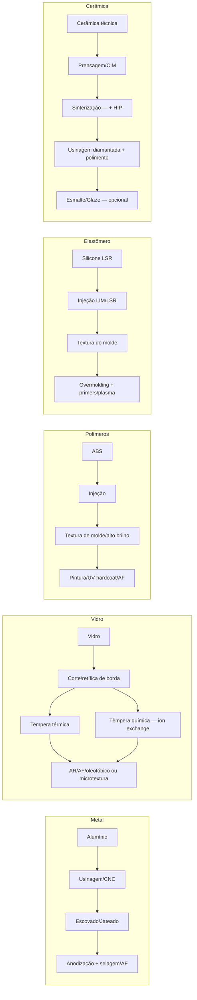

# Propriedades organolépticas e engenharia de processos de cinco materiais-chave para design de produto

## Sumário executivo

As propriedades organolépticas (o que o usuário vê, toca, ouve e, às vezes, cheira ou tasta) não são apenas subjetivas: elas emergem de grandezas físicas mensuráveis e, sobretudo, de como os **processos** configuram a **superfície** — microtextura, nanotextura, energia de superfície, tratamentos, porosidade, camadas e tensões residuais.

Três mecanismos explicam grande parte das percepções nesses cinco materiais:

**Troca térmica na pele ("frio/quente")**: a sensação térmica ao toque é fortemente governada pela **efusividade térmica** $e = \sqrt{k \rho c_p}$. Materiais com maior efusividade "puxam" calor da pele mais rápido e parecem **mais frios e "premium"** no primeiro contato — padrão consistente em estudos de percepção tátil ligados a propriedades físicas.

**Atrito e área real de contato ("escorregadio/aderente", "sedoso/grudando")**: o contato dedo–superfície é dominado por aderência, hidratação da pele, textura e química superficial. Pequenas mudanças de topografia e coating alteram o coeficiente de atrito (CoF) e, com ele, a sensação. Em vidro, por exemplo, texturização pode reduzir CoF e aumentar avaliações subjetivas de "confortável", "sedoso" e "escorregadio".

**Rigidez, massa e amortecimento ("som", "solidez", "fragilidade")**: módulos elásticos e densidade influenciam vibração e ressonância. Polímeros e elastômeros amortecem e "matam" o som; vidro e cerâmica tendem a soar mais "brilhantes"; metais soam "secos/duros". Esses efeitos são modulados por espessura, fixação e interface (adesivos, gaxetas, overmolding).

No recorte deste relatório, a hierarquia sensorial típica em produtos "premium" é construída por **contrastes**: metal e corpos rígidos para estrutura e "frio"; vidro e cerâmica para "joia/precisão/limpeza"; polímeros para zonas de toque, proteção e absorção de impacto; elastômero para grip, vedação e conforto.

---

## 1. Alumínio anodizado

### Mapa organoléptico

**Visão:** brilho controlável (fosco a semi-brilho), cor sólida via anodização colorida com leitura "técnico-premium"; escovado direcional evidencia precisão mecânica e orienta o percurso visual sobre a forma.

**Tato:** "frio" imediato e sensação de rigidez; microtextura (jateado ou escovado) altera a percepção de "sedoso" a "grip". Jateado produz grip isotrópico; escovado, direcionalidade.

**Audição:** resposta "seca" em cliques e impactos — transientes curtos que comunicam solidez estrutural quando o conjunto está bem desacoplado de vibrações internas.

**Olfato/paladar:** normalmente neutro. A variável dominante é resíduo de processo ou limpeza, não o metal em si.

### Drivers físicos mensuráveis

A assinatura "fria" decorre da **alta efusividade** do alumínio. Para a liga 6061, o NIST registra $k \approx 154\ \text{W/m·K}$ e $c_p \approx 943\ \text{J/kg·K}$ a ~293 K. Com densidade ~2,70 g/cm³, obtém-se $e \approx 2{,}0 \times 10^4\ \text{W·s}^{0,5}\text{/m}^2\text{·K}$ — muito acima de polímeros e vidro, o que explica o "frio" no primeiro toque.

A **rigidez** (módulo elástico ~69–70 GPa para ligas 6xxx) e a densidade relativamente baixa em relação ao aço sustentam paredes finas com boa estabilidade dimensional, favorecendo percepção de precisão e ausência de flexão.

No anodizado, a superfície passa a ser **óxido de alumínio**: hard anodize (Tipo III) atinge microdurezas de centenas de HV, alterando atrito e resistência ao desgaste de forma significativa.

### Processos e impacto na experiência

**CNC/usinagem + escovamento/jateamento:** define macro e microtextura, modulando brilho, direcionalidade e atrito percebido. Escovado direcional cria "sedoso com eixo"; jateado cria grip isotrópico suave.

**Anodização (tipos e selagem):** conforme MIL-A-8625, a selagem é padrão para a maioria dos tipos, mas o Tipo III (hard anodize) pode permanecer **não selado** quando o objetivo é maximizar resistência ao desgaste — com o custo de maior porosidade superficial. Em termos organolépticos: **selado = toque "fechado/limpo"**; **não selado = potencial "chalky feel"**, porém maior performance tribológica. A especificação também esclarece que "touch-up" local não restaura resistência à abrasão, embora recupere proteção anticorrosiva.

**Coatings anti-impressão digital (AF) e PVD/DLC:** reduzem energia superficial, alteram atrito e limpabilidade. Em superfícies de alto toque, coatings AF são tratados pela indústria como requisito funcional de UX, não decoração.

### Implicações CMF/UX

Alumínio anodizado funciona como **âncora de hierarquia** no sistema de materiais: posiciona-se onde o usuário precisa ler "núcleo/estrutura/valor". A anodização permite cor sem perder leitura metálica. Escovado direcional deve ser usado para orientar (fluxo, eixo, pegada) e "afinar" volumes. O contraste com vidro (brilho óptico) e silicone (conforto/grip) cria vocabulário tátil e visual coerente.

**Caso emblemático:** Apple descreve o iPad Pro com "unibody enclosure of anodized aluminum", explicitando a intenção organoléptica de "sturdy feel" associada ao material e acabamento.

### Restrições e ciclo de vida

**Tolerâncias:** anodização adiciona espessura e exige controle de máscara e contato elétrico; dimensões finais devem ser previstas após coating.

**Reparo:** reanodizar e fazer blend cosmético é difícil em campo; touch-up químico não devolve resistência à abrasão.

**Reciclabilidade:** alumínio é altamente reciclável — a reciclagem economiza ~95% da energia em relação à produção primária (International Aluminium Institute; The Aluminum Association; US EPA).

**Custo/escala:** CNC escala com tempo de máquina e yield cosmético; em grande volume, extrusão + usinagem local ou fundição + usinagem são alternativas com trade-off entre estrutura e custo.

---

## 2. Vidro tratado e temperado

### Mapa organoléptico

**Visão:** alto brilho e "profundidade" óptica; transmite precisão, limpeza e fragilidade latente. Coatings AR (antirreflexo) aumentam contraste percebido e a sensação de "profundidade".

**Tato:** sensação "fria e lisa", porém com grande variabilidade de atrito conforme umidade da pele, textura submicrométrica e coatings. Um estudo de swipe em vidro plano vs. texturizado registrou CoF típico de ~0,7–1,2 (variando com textura e direção), com texturas associadas a menor CoF e melhores avaliações subjetivas de "slippery", "silky" e "comfortable".

**Audição:** "clink" agudo, indicativo de rigidez (~72 GPa). Em queda ou impacto, o som comunica fragilidade mesmo quando o vidro está mecanicamente reforçado — efeito psicológico relevante para UX. Vidro temperado fragmenta em pedaços menores (fratura segura), alterando a percepção de risco.

**Olfato/paladar:** essencialmente neutro. Coatings AF/AR podem ter odor residual durante cura, mas o produto final é inerte.

### Drivers físicos mensuráveis

Para vidro soda-lime: densidade ~2.500 kg/m³, $E$ ~72 GPa, dureza Mohs 5–6, $k$ ~0,94 W/m·K, $c_p$ ~0,88 kJ/kg·K. Efusividade resultante: $e \approx 1{,}4 \times 10^3\ \text{W·s}^{0,5}\text{/m}^2\text{·K}$ — sensação "fria", porém bem menos intensa que o alumínio.

**Tempera térmica:** aquecimento até ~621 °C e resfriamento rápido (quenching) introduzem tensões de compressão superficial. Conforme ASTM C1048: heat-strengthened ~3.500–7.500 psi; fully tempered ≥10.000 psi (~69 MPa).

**Reforço químico (ion exchange):** imersão em banho de KNO₃ abaixo de $T_g$ substitui íons menores por maiores, criando compressão superficial muito mais elevada. Em vidro aluminosilicato reforçado (ex.: Corning Gorilla Glass 3), CS pode atingir ~950 MPa com profundidade de camada (DOL) de dezenas de micrômetros. Para o aluminosilicato: densidade ~2,39 g/cm³, módulo ~70 GPa, dureza Vickers que sobe de ~555 para ~653 kgf/mm² após reforço.

### Processos e impacto na experiência

**Corte/retífica de borda:** crítico para resistência e percepção ("lasca na borda = barato"). Define também a viabilidade da tempera — vidro não pode ser retrabalhado após temperagem.

**Tempera térmica:** muda dramaticamente o comportamento de quebra (fragmentos menores), alterando UX de segurança percebida.

**Reforço químico:** além de elevar a resistência a danos, melhora resistência a riscos e lascamento em uso e pode elevar dureza por indentação.

**Coatings AR/AF/oleofóbicos:** alteram glide, marcas de dedo e limpabilidade. A estratégia de coating centra-se em energia de superfície e rugosidade para reduzir smudge e melhorar UX em alto toque.

**Texturização micro/nano:** reduz área real de contato e CoF; eleva avaliações subjetivas de "slippery/light/silky".

### Implicações CMF/UX

Vidro funciona como **camada de interface direta** (telas, painéis, tampas, "janelas") porque combina estabilidade dimensional, estética óptica e compatibilidade com coatings funcionais. Sem engenharia de atrito, porém, pode ser "rampa escorregadia" (risco de quedas) e "ímã de manchas". O pacote microtextura + coating deve ser especificado como requisito de UX, não como acabamento tardio.

**Caso emblemático:** Corning publica fichas técnicas do Gorilla Glass com métricas de CS e DOL, mostrando como a cadeia de valor traduz "experiência" em especificação mensurável.

### Restrições e ciclo de vida

**Reparo:** baixo — trincou ou lascou, troca-se o módulo. Coatings desgastam e são difíceis de repor em campo.

**Reciclabilidade:** vidro pode ser refundido repetidamente sem degradação de qualidade; cullet reduz temperatura de fusão e energia. Ressalva: análises independentes (NREL) indicam que a economia de energia na reciclagem pode ser mais modesta do que o senso comum assume, e que reuso direto pode ser superior quando logisticamente viável.

---

## 3. Silicone soft-touch elastomérico (LSR)

### Mapa organoléptico

**Visão:** tende ao mate e "amigável"; pode variar de translúcido a opaco/pigmentado. Absorve luz, reduz reflexos e transmite "calma" visual.

**Tato:** "quente"/neutro (baixa efusividade), macio, alto amortecimento e alto "snap-back" — ideal para conforto contínuo. Potencialmente mais aderente ("grippy"), o que é ótimo para controle mas gera risco de retenção de sujeira dependendo de formulação e acabamento.

**Audição:** amortecido ("mute"). Reduz ruído de impacto e vibração de forma significativa. Em overmolding sobre ABS ou metal, funciona como camada de amortecimento acústico.

**Olfato/paladar:** propriedade de destaque entre os cinco materiais. Graus formulados para contato oral e com pele sensível (infantil, médico) incluem controle de voláteis e extrativos. Ensaios USP Class VI e conformidade para food contact são as traduções regulatórias dessas propriedades organolépticas "invisíveis". Silicone de grau inadequado pode ter odor residual de catalisadores ou plastificantes.

### Drivers físicos mensuráveis

Efusividade baixa: para silicone não altamente carregado, $k \approx 0{,}2\ \text{W/m·K}$, $c_p \approx 1050\text{–}1300\ \text{J/kg·K}$, resultando em $e \approx 5 \times 10^2\ \text{W·s}^{0,5}\text{/m}^2\text{·K}$ — explica a sensação "quente/neutra" ao toque.

Em LSR para injeção: densidade típica ~1,1–1,13 g/cm³, Shore A ~42 (grau médio), alta elongação. Módulo muito inferior ao dos termoplásticos rígidos e metais.

### Processos e impacto na experiência

**LIM/LSR injection molding:** processo dominante para peças de precisão. A janela de dureza/viscosidade (Shore A) impacta diretamente maciez percebida, snap-back e conforto.

**Textura do molde:** é o principal acabamento do silicone — a peça sai pronta, sem pintura. VDI/SPI do molde define o toque final. A química do elastômero amplifica o efeito da microtextura no atrito percebido.

**Overmolding (silicone sobre ABS/metal):** cria zonas de pegada e soft-touch local. Do ponto de vista organoléptico, a interface (linha de partição, adesão, retração diferencial) é tão determinante quanto o material em si.

**Tratamentos de adesão (primer/plasma):** alteram energia superficial. Podem causar pegajosidade residual se houver migração ou contaminação — devem ser controlados.

### Implicações CMF/UX

Silicone soft-touch é ideal para **zonas de contato contínuo** (empunhaduras, botões, anéis de proteção, juntas aparentes) e para "humanizar" produtos rígidos. Funciona especialmente bem quando o sistema de materiais explicita a hierarquia: **rigidez estrutural (metal/ABS) + interface de conforto (silicone)**. Para superfícies "de exibição", silicone pode exigir textura e cor para mascarar contaminação e variação de brilho.

### Restrições e ciclo de vida

**Durabilidade:** excelente em faixa térmica ampla e para intemperismo; soft-touch pode sofrer abrasão superficial dependendo de formulação.

**Reciclabilidade:** como elastômero reticulado, não remelte. Reciclagem mecânica tende a downcycling; rotas químicas estão em desenvolvimento mas ainda têm desafios industriais. Favorece-se silicone quando ele entrega longevidade/funcionalidade e quando a arquitetura do produto evita mistura inseparável de materiais.

---

## 4. ABS de alta qualidade

### Mapa organoléptico

**Visão:** altamente versátil — de "piano black" brilhante a mate técnico. Boa leitura de cor e pigmentação; pode imitar cerâmica ou metal via pintura, metalização a vácuo ou coatings. Linhas de fluxo, marcas de gate e variação de gloss por geometria de moldagem são os principais inimigos visuais.

**Tato:** termicamente "neutro/quente" (baixa efusividade). Sensação de rigidez moderada — a percepção de solidez depende fortemente de geometria (nervuras, fechamentos) e tolerância de encaixe. Qualidade percebida sobe com boa espessura local, encaixes precisos, texturas consistentes e ausência de rebarbas.

**Audição:** mais amortecido que vidro e metal. "Rangidos" (squeaks) aparecem quando há atrito entre peças ABS ou baixa rigidez do conjunto — principal problema acústico de uso. Coatings de alta dureza (UV hardcoat) podem "endurecer" o som de impacto, aproximando-o do vidro.

**Olfato/paladar:** pode ser relevante nas primeiras semanas após fabricação/embalagem (voláteis de processo). Graus com conformidade para food contact existem, indicando controle de formulação e migração.

### Drivers físicos mensuráveis

Ficha técnica CYCOLAC MG94F (SABIC): módulo de tração ~2.400 MPa, densidade ~1,04 g/cm³, dureza Rockwell R ~129, shrinkage ~0,5–0,7%, MVR alto para paredes finas.

Termicamente: $k \approx 0{,}18\text{–}0{,}25\ \text{W/m·K}$, $c_p \approx 1.250\text{–}2.400\ \text{J/kg·K}$, resultando em $e \approx 5 \times 10^2\text{–}8 \times 10^2\ \text{W·s}^{0,5}\text{/m}^2\text{·K}$ — sustenta o toque "menos frio". Módulo ~30× menor que o alumínio: a percepção de solidez é geometria-dependente.

### Processos e impacto na experiência

**Injeção:** rota dominante. O shrinkage (~0,5–0,7%) e o MVR alto convertem-se diretamente em capacidade de produzir detalhes e "tight gaps" — determinantes de qualidade percebida em CMF.

**Textura e polimento de molde:** definem brilho e tato; texturas difusas reduzem marcas de dedo sem coating dedicado.

**Pintura/UV hardcoat/metalização a vácuo:** elevam dureza superficial e podem criar sensação "vidro-like". Adicionam, porém, risco de desgaste localizado e descolamento que são percebidos como "barato" quando falham.

### Implicações CMF/UX

ABS é um **material de sistema**: excelente para estruturas internas, carcaças, frames e volumes com geometrias ricas. O caminho para "ABS premium" passa por: **controle de textura** (uniformidade), **arquitetura de juntas** (shadow gap consistente), e **evitar contato direto em zonas onde o usuário espera "frio/premium"** — nesses pontos, metal, vidro ou cerâmica ganham. Em contrapartida, ABS é ótimo onde quedas e impactos são prováveis, pois absorve energia.

**Caso emblemático:** Dyson publica especificações técnicas com "Polycarbonate-ABS casing", exemplificando ABS/PC como escolha de engenharia para carcaças robustas em equipamentos de uso intenso.

### Restrições e ciclo de vida

**Durabilidade:** boa tenacidade e resistência a impacto, mas pode sofrer com solventes e UV dependendo do grau e pigmentação.

**Reciclabilidade:** termoplástico reciclável em princípio; na prática, cor, aditivos e contaminação são limitantes. Decisões CMF (metalização, coatings, cores) impactam a circularidade futura.

---

## 5. Cerâmica técnica e cerâmica esmaltada

### Mapa organoléptico

**Visão:** "joia" — alto brilho com polimento fino, profundidade de cor e aspecto "inorgânico" associado a durabilidade. Estabilidade de cor superior: o glaze não desbota como tintas orgânicas (resistência química e UV intrínseca). Na versão esmaltada, cor e brilho profundos com variações tipicamente mais ricas que metal anodizado.

**Tato:** "liso, duro e frio limpo". Superfícies cerâmicas podem atingir rugosidades nanométricas após polimento avançado (dezenas de nm de Ra em estudos de polimento de zircônia), o que é central para o toque "sedoso" e para a baixa retenção de sujeira. Posicionamento térmico: mais "fria" que polímeros, próxima do vidro, abaixo dos metais — sensação distinta e reconhecível.

**Audição:** "clack" agudo que comunica dureza imediata. Transientes mais agudos que polímeros; diferenciável do metal por timbre. Em conjunto com metal, complementa e reforça o vocabulário sonoro "premium".

**Olfato/paladar:** geralmente neutro e quimicamente estável. Glazes e cerâmicas são frequentemente escolhidos para contato alimentar e aplicações médicas precisamente pela baixíssima migração e inércia química.

### Drivers físicos mensuráveis

Para zircônia técnica: densidade ~5,7 g/cm³, $E$ ~200 GPa, $K_{Ic}$ ~17 MPa·m$^{0,5}$, dureza ~13 GPa (~1.300 HV), $k$ ~3 W/m·K. Com $c_p$ ~460 J/kg·K, efusividade $e \approx 2{,}4\text{–}3{,}1 \times 10^3\ \text{W·s}^{0,5}\text{/m}^2\text{·K}$ — mais "fria" que vidro em alguns casos, muito acima de polímeros, abaixo de metais.

Para **cerâmica esmaltada**: o esmalte é um coating inorgânico vítreo baseado em sílica, obtido por queima em alta temperatura. Associações europeias do setor especificam dureza mínima Mohs ≥5 para coatings de esmalte em aplicações definidas.

### Processos e impacto na experiência

**CIM (Ceramic Injection Molding)/pressagem + sinterização (+HIP):** controla porosidade (resistência a manchas, aparência) e retração (tolerâncias). Porosidade residual degrada resistência a manchas e aparência cosmética.

**Usinagem diamantada e polimento:** definem o "toque joia" — rugosidades nanométricas são o resultado. Elevam custo e risco de yield cosmético.

**Esmaltação/glaze:** adiciona camada vítrea que determina cor, brilho e resistência química; pode reduzir rugosidade superficial e alterar dureza.

### Implicações CMF/UX

Cerâmica técnica é excelente para **componentes de alto valor percebido** (backs, molduras, anéis, botões "jewel"), onde estabilidade de cor e resistência a riscos são prioritárias. É um bom contraponto ao vidro: ambos são "inorgânicos", mas a cerâmica pode comunicar "mais raro" por ser menos comum e por exigir processamento mais exigente. Funciona bem em **zonas de assinatura** (partes menores e altamente tocadas) e em **zonas de durabilidade cosmética** (onde anodizado pode mostrar desgaste de cor ao longo do tempo).

Design deve evitar cantos vivos e tensões concentradas — fragilidade a impacto é a principal limitação do material.

**Caso emblemático:** relógios com "parte de trás em cerâmica" ou "ceramic case" ilustram a lógica de posicionar cerâmica onde há contato com pele e demanda por estabilidade cosmética duradoura.

### Restrições e ciclo de vida

**Fragilidade:** apesar de alta dureza e boa tenacidade relativa para cerâmica, suscetível a trincas por impacto e defeitos de aresta.

**Reciclabilidade:** raramente retorna a loop fechado; em geral vira inerte ou agregado. O ganho ambiental costuma vir de **durabilidade estética** e baixa necessidade de substituição, mais do que de reciclagem em ciclo fechado.

---

## Síntese comparativa

### Matriz de processo–sensação

O diagrama evidencia um ponto prático: em todos os cinco materiais, a **superfície** é o principal "botão" de organolepsia. O "bulk" define a ordem de grandeza (rigidez, efusividade), mas é o pacote de processo que decide "sedoso vs. pegajoso", "limpo vs. manchado", "premium vs. genérico".

### Tabela comparativa

| Material | Assinatura sensorial dominante | Métricas físicas (ordem de grandeza) | Processos mais determinantes de UX | Uso recomendado em sistemas de produto |
|---|---|---|---|---|
| Alumínio anodizado | Frio "premium", rígido, técnico | $e \sim 2 \times 10^4$; $E \sim 70$ GPa; densidade ~2,70 g/cm³ | CNC + escovado/jateado + anodização + AF | Estrutura e âncora de valor; áreas onde "frio" é desejável; contraste com elastômero |
| Vidro tratado/temperado | Brilho óptico, limpo; atrito variável | $e \sim 1{,}4 \times 10^3$; $E \sim 72$ GPa; CS até ~950 MPa (químico) | Tempera + ion exchange + AR/AF/oleofóbico + microtextura | Interface UI/UX, painéis, tampas; especificar glide e anti-smudge como requisito |
| Silicone LSR | Macio, quente, grip; som amortecido | $e \sim 5 \times 10^2$; $k \sim 0{,}2$ W/m·K; Shore A ~42 | LIM/LSR + textura de molde + overmolding | Zonas de toque/pegada/vedação; humanizar produtos rígidos |
| ABS (alto padrão) | Neutro/quente; sólido se bem estruturado | $e \sim 5\text{–}8 \times 10^2$; módulo ~2,4 GPa; densidade ~1,04 g/cm³ | Injeção + textura de molde + hardcoat | Carcaças, frames, volumes complexos; bom para impacto |
| Cerâmica técnica/esmalte | "Joia", duro, frio limpo, estável | $e \sim 2{,}4\text{–}3{,}1 \times 10^3$; $E \sim 200$ GPa; dureza ~1.300 HV | CIM + sinterização + polimento diamantado + glaze | Peças de assinatura e alta resistência cosmética |

**Hierarquia de efusividade (frio ao primeiro toque):**

$$\text{Alumínio} \gg \text{Cerâmica} > \text{Vidro} \gg \text{ABS} \approx \text{Silicone}$$

### Diretrizes práticas

**Hierarquia de materiais por "promessa" ao toque:** metal e cerâmica comunicam "núcleo/valor" via frio e dureza; vidro comunica "precisão/limpeza" via ótica; ABS comunica "robustez acessível" e liberdade formal; silicone comunica "cuidado/controle" via maciez e grip.

**Projetar glide e limpabilidade como requisitos:** para vidro e metal em alto toque, coatings (oleofóbico/AF) e microtexturas devem ser especificados com testes (CoF de swipe, durabilidade do coating, resistência química). Pequenas mudanças de superfície alteram significativamente CoF e avaliações subjetivas.

**Reparabilidade e ciclo de vida influenciam CMF:** anodização tem reparo cosmético limitado; vidro e cerâmica raramente são reparáveis em campo; polímeros permitem troca de partes, mas coatings podem descascar. Isso sugere arquiteturas que isolam "partes de desgaste" em componentes substituíveis e mantêm o "núcleo premium" protegido.

### Sustentabilidade por material

**Alumínio:** reciclagem economiza ~95% da energia vs. produção primária (International Aluminium Institute; The Aluminum Association; US EPA). Ponto forte quando o design facilita separação e reduz contaminação de ligas e insertos.

**Vidro:** consenso setorial de que cullet reduz energia de fusão e que o vidro pode ser refundido repetidamente (FEVE). Ressalva: análises energéticas independentes (NREL) indicam que a economia pode ser mais modesta do que o senso comum assume, e que reuso direto pode ser superior quando logisticamente viável.

**Silicone:** reciclagem mecânica tende a downcycling; rotas químicas em desenvolvimento. Favorece-se silicone quando entrega longevidade funcional e quando a arquitetura evita mistura inseparável de materiais.

**ABS:** termoplástico com potencial de reciclagem mecânica; cor, aditivos e coatings limitam a qualidade do material reciclado. Decisões CMF (metalização, pigmentação intensa) impactam a circularidade futura.

**Cerâmica/esmalte:** raramente retorna a loop fechado; vira inerte ou agregado. Ganho ambiental vem principalmente de durabilidade estética e baixa frequência de substituição.

---

## Referências

ASHBY, M. F.; JOHNSON, K. **Materials and design: the art and science of material selection in product design**. 2. ed. Amsterdam: Elsevier/Butterworth-Heinemann, 2010.

ASTM INTERNATIONAL. **ASTM C1048: Standard specification for heat-strengthened and fully tempered flat glass**. West Conshohocken: ASTM, 2018.

CALEGARI, E. P.; OLIVEIRA, B. F. de. Um estudo focado na relação entre design e materiais. **Projética**, Londrina, v. 4, n. 1, p. 49-64, jan./jun. 2013.

CORNING INCORPORATED. **Gorilla Glass 3 product datasheet**. Corning: Corning Inc., [s.d.]. Disponível em: corning.com/gorillaglass.

FEVE — EUROPEAN CONTAINER GLASS FEDERATION. **Glass recycling hits new record in Europe**. Brussels: FEVE, 2022.

FLUSSER, Vilém. **O mundo codificado**: por uma filosofia do design e da comunicação. São Paulo: Cosac Naify, 2007.

INGOLD, Tim. **Making: anthropology, archaeology, art and architecture**. London: Routledge, 2013.

INTERNATIONAL ALUMINIUM INSTITUTE. **Global aluminium recycling: a cornerstone of sustainable development**. London: IAI, 2009.

LÖBACH, Bernd. **Design industrial**: bases para a configuração dos produtos industriais. São Paulo: Edgard Blücher, 2001.

MILITARY SPECIFICATION. **MIL-A-8625F: anodic coatings for aluminum and aluminum alloys**. Washington: US Department of Defense, 1993.

NATIONAL INSTITUTE OF STANDARDS AND TECHNOLOGY (NIST). **Thermophysical properties of aluminum alloy 6061**. Gaithersburg: NIST, [s.d.]. Disponível em: webbook.nist.gov.

NATIONAL RENEWABLE ENERGY LABORATORY (NREL). **Life cycle assessment of glass**. Golden: NREL, 2011.

SABIC. **CYCOLAC MG94F ABS resin datasheet**. Pittsfield: SABIC, [s.d.].

SAPUAN, S. M. A knowledge-based system for materials selection in mechanical engineering design. **Materials & Design**, v. 22, n. 8, p. 687-695, 2001.

SCHNEIDER, Beat. **Design — uma introdução**: o design no contexto social, cultural e econômico. São Paulo: Edgard Blücher, 2010.

THE ALUMINUM ASSOCIATION. **The aluminum advantage: sustainability and recycling**. Arlington: The Aluminum Association, 2020.

US ENVIRONMENTAL PROTECTION AGENCY (EPA). **Aluminum: material-specific data**. Washington: EPA, 2021. Disponível em: epa.gov/facts-and-figures-about-materials-waste-and-recycling.
